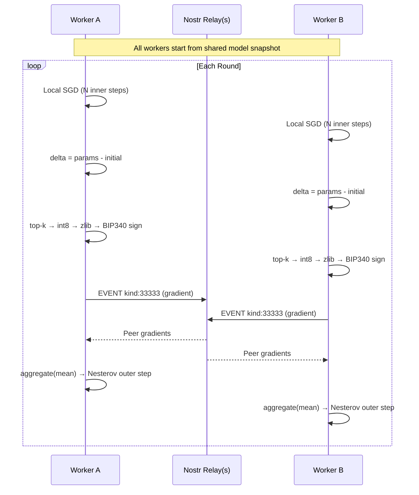

<div align="center">

# nostrain

**Coordinator-free distributed ML training over Nostr relays.**

Workers exchange compressed, Schnorr-signed pseudo-gradients through public WebSocket relays.<br>No central server. No custom infrastructure. Just [DiLoCo](https://arxiv.org/abs/2311.08105) over [Nostr](https://nostr.com).

[](https://python.org)
[](https://nostr.com)
[](https://arxiv.org/abs/2311.08105)
[](https://pypi.org/project/websockets/)

<br>


<p><sub>4 workers exchanging gradients through a local relay — live round-by-round progress</sub></p>


<p><sub>All workers converge to the same model — 97-99% loss reduction across data shards</sub></p>

</div>

---

## How it works



## Quick start

**1. Install**

```bash
pip install -e .
```

**2. Initialize a model**

```bash
nostrain init-state --runtime linear-regression --features 3 -o model.json
```

**3. Train across relays**

```bash
# Run this on each machine with different data shards
nostrain run-training model.json data.json \
  --relay wss://relay.damus.io \
  --relay wss://nos.lol \
  --run my-experiment \
  --sec-key $NOSTR_SECRET_KEY \
  --rounds 5 \
  --inner-steps 80 \
  --outer-learning-rate 0.7 \
  --momentum 0.9 \
  -o trained.json
```

Workers discover each other via heartbeat events and sync automatically.

## Demo

Run the full 4-worker demo locally with a single command:

```bash
bash demo/run.sh
```

This starts a local relay, generates 4 non-overlapping data shards for `y = 3x₁ - 1.5x₂ + 0.5x₃ + 1`, launches 4 workers in tmux, and shows a convergence summary when training completes.

## Compression pipeline

```
pseudo_gradient = params - initial
        │
        ▼
  top-k sparsification ─── keep k% largest values
        │
        ▼
  int8 quantization ────── scale to [-127, 127]
        │
        ▼
  NSTR wire format ─────── magic + sparse index layout
        │
        ▼
  zlib/zstd ────────────── compressed bytes
        │
        ▼
  base64 → Nostr event content
```

A 10k-parameter gradient at `topk=0.1` compresses to ~1KB.

## Nostr protocol

Three NIP-01 event kinds, all BIP340 Schnorr signed:

| Kind | Type | Content |
|:---:|---|---|
| `33333` | Gradient | Compressed pseudo-gradient payload (base64) |
| `33334` | Heartbeat | Empty — capabilities and relay hints in tags |
| `33335` | Checkpoint | Serialized training state for recovery |

Works with any relay that indexes on `kind` and `#t` tags.

## Configuration

### `run-training` flags

| Flag | Default | Description |
|---|:---:|---|
| `--relay` | *required* | WebSocket relay URL (repeatable) |
| `--run` | *required* | Shared run name across workers |
| `--sec-key` | *required* | Hex Nostr secret key |
| `--rounds` | `1` | Number of outer rounds |
| `--inner-steps` | `500` | Local SGD steps per round |
| `--local-learning-rate` | `0.01` | Inner loop learning rate |
| `--outer-learning-rate` | `0.7` | DiLoCo outer step learning rate |
| `--momentum` | `0.9` | Nesterov outer momentum |
| `--batch-size` | `1` | Mini-batch size |
| `--topk` | `1.0` | Gradient sparsity (0.1 = keep 10%) |
| `--round-timeout` | `2.0` | Seconds to wait for peer gradients |
| `--backend` | `python` | `python`, `numpy`, or `torch` |
| `--resume-latest-checkpoint` | — | Rejoin from relay-distributed checkpoint |

### Sync strategies (for `collect-events` / `aggregate-round`)

| Strategy | Behavior |
|---|---|
| `timeout` | Aggregate whatever arrives within N seconds |
| `strict` | Wait for exactly N workers |
| `quorum` | Wait for majority of discovered workers |
| `async` | Return immediately with local gradient only |

## Fault tolerance

- **Multi-relay** — publish to N relays, collect from all, deduplicate by event fingerprint
- **Retry + backoff** — configurable exponential backoff on transient failures
- **Late gradients** — fold into next round (`deferred`) or record-only (`discard`)
- **Checkpoint recovery** — resume from local file or discover latest from relay
- **Rolling retention** — bound relay-visible checkpoint history per worker

## State formats

```bash
nostrain convert-state model.json -o model.npz       # NumPy archive
nostrain convert-state model.json -o model.pt.npz     # PyTorch state-dict archive
nostrain convert-state model.json -o model.pt         # Native torch.save
```

PyTorch import auto-handles `module.*` prefixes, `state_dict`/`model_state_dict` wrappers, and nested checkpoint bundles.

## CLI

```
nostrain init-state             Initialize model state for a built-in runtime
nostrain hash-state             Deterministic model hash
nostrain convert-state          Convert between JSON / npz / pt formats

nostrain encode-delta           Compress a pseudo-gradient
nostrain decode-payload         Decompress a payload
nostrain apply-payload          Reconstruct state from base + payload
nostrain aggregate-payloads     Average multiple worker payloads

nostrain outer-step             Apply DiLoCo outer step with momentum
nostrain train-local            Run inner SGD loop locally

nostrain build-event            Build signed gradient event
nostrain build-heartbeat        Build signed heartbeat event
nostrain build-checkpoint       Build signed checkpoint event
nostrain inspect-event          Validate and inspect an event

nostrain publish-event          Publish to relay(s)
nostrain collect-events         Collect round events from relay(s)
nostrain aggregate-round        Collect + aggregate in one step
nostrain discover-workers       List active workers
nostrain discover-checkpoints   Find latest checkpoint
nostrain derive-pubkey          Derive pubkey from secret key

nostrain run-training           Full distributed training session
```

## Python API

```python
from nostrain import (
    compute_delta, compress_delta, state_digest,
    aggregate_deltas, nesterov_outer_step,
    build_gradient_event, schnorr_sign,
    run_training_session, TrainingWorkerConfig,
)

# Compress a pseudo-gradient
delta = compute_delta(initial_state, trained_state)
payload = compress_delta(delta, topk_ratio=0.1)

# Publish as a signed Nostr event
event = build_gradient_event(
    payload=payload,
    run_name="experiment-1",
    round_number=0,
    worker_id=pubkey,
    model_hash=state_digest(initial_state),
    secret_key=secret_key,
)
```

## Optional dependencies

| Extra | Package | Enables |
|---|---|---|
| `numpy` | `numpy>=1.26` | `.npz` state I/O, NumPy training backend |
| `torch` | `torch>=2.1` | `.pt`/`.pth` checkpoints, torch training backend |
| `zstd` | `zstandard>=0.22` | zstd compression (default: zlib) |

```bash
pip install -e ".[numpy,torch,zstd]"
```

## Design decisions

**Why Nostr?** Public relay infrastructure already exists — WebSocket pub/sub at scale with cryptographic identity built in. Zero servers to deploy.

**Why pure-Python crypto?** BIP340 Schnorr signatures using only `hashlib`. No compiled extensions, installs everywhere.

**Why framework-agnostic transport?** The wire protocol never imports `torch` or `numpy`. Framework code lives at the edges and is entirely optional.

## License

MIT
