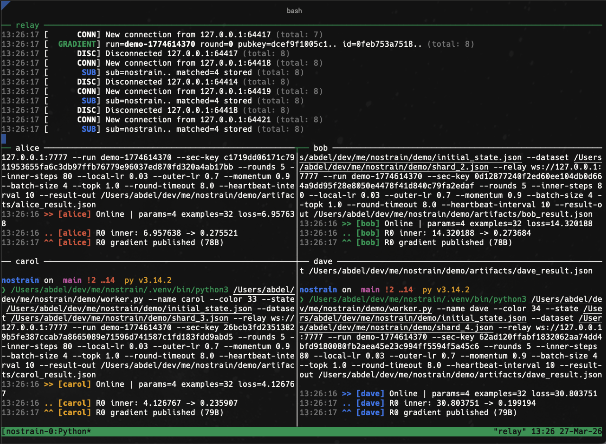
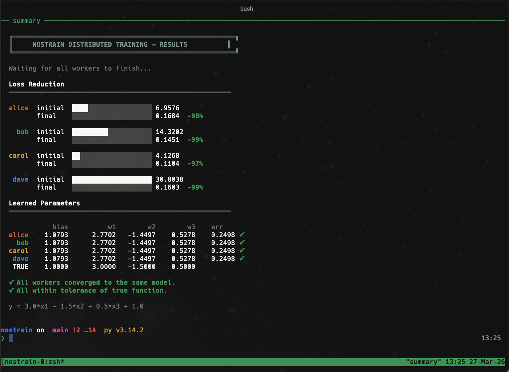

# nostrain

Distributed ML training over [Nostr](https://nostr.com) relays. No coordinator, no central server — workers exchange compressed pseudo-gradients through public WebSocket relays using [DiLoCo](https://arxiv.org/abs/2311.08105)-style outer optimization.

<div align="center">

<p><em>4 workers exchanging gradients through a local relay — each pane shows live round progress</em></p>
</div>

<div align="center">

<p><em>All workers converge to the same model — loss reduced 97-99% across shards</em></p>
</div>

## How it works

```
Worker A                    Nostr Relays                   Worker B
   |                      (public infra)                      |
   |-- local SGD steps -->                                    |
   |                                                          |
   |   compress(topk + int8 + zlib)                           |
   |   sign(BIP340 Schnorr)                                   |
   |                                                          |
   |-------- EVENT kind:33333 -------->                       |
   |                           <-------- EVENT kind:33333 ----|
   |                                                          |
   |   verify + decompress                                    |
   |   aggregate(mean)                                        |
   |   outer_step(Nesterov momentum)                          |
   |                                                          |
   |-- next round ---------------------------------------->   |
```

Each worker trains locally, compresses the pseudo-gradient (`params - initial`), publishes it as a signed Nostr event, collects gradients from peers, and applies the aggregated update. Repeat.

## Install

```bash
pip install -e .
```

With optional backends:

```bash
pip install -e ".[numpy]"     # NumPy state interchange + backend
pip install -e ".[torch]"     # PyTorch checkpoints + backend
pip install -e ".[zstd]"      # zstd compression (default: zlib)
```

Only hard dependency: `websockets`.

## Quick start

**Initialize a model and run a distributed training session:**

```bash
# Generate initial model state
nostrain init-state --runtime linear-regression --features 2 -o model.json

# Run a worker — connects to relays, trains, exchanges gradients
nostrain run-training model.json data.json \
  --relay wss://relay.damus.io \
  --relay wss://nos.lol \
  --run my-experiment \
  --sec-key $NOSTR_SECRET_KEY \
  --inner-steps 50 \
  --local-learning-rate 0.05 \
  --outer-learning-rate 1.0 \
  --momentum 0.9 \
  --round-timeout 5.0 \
  -o trained.json
```

Run the same command on another machine with different data. Workers discover each other via heartbeats and sync gradients through the relays.

**Resume from a relay-distributed checkpoint:**

```bash
nostrain run-training model.json data.json \
  --relay wss://relay.damus.io \
  --run my-experiment \
  --sec-key $NOSTR_SECRET_KEY \
  --resume-latest-checkpoint \
  -o resumed.json
```

## Architecture

```
nostrain/
  model.py          Tensor state, deltas, hashing
  compression.py    Top-k sparsification, int8 quantization, wire format
  aggregation.py    Mean aggregation, Nesterov outer step
  crypto.py         BIP340 Schnorr signatures (pure Python, no native deps)
  protocol.py       NIP-01 event builders/parsers (kind 33333/33334/33335)
  relay.py          Async WebSocket transport, multi-relay, dedup, discovery
  training.py       End-to-end training loop with checkpointing
  runtime.py        Built-in runtimes (linear, MLP) with python/numpy/torch backends
  stateio.py        State I/O: JSON, .npz, .pt.npz, .pt/.pth
  pytorch.py        PyTorch state-dict bridge, nn.Module materialization
  cli.py            Full CLI
```

## Compression pipeline

```
pseudo_gradient = current_params - initial_params
    |
    v
top-k sparsification (keep k% of largest values)
    |
    v
int8 quantization (scale to [-127, 127])
    |
    v
binary wire format (NSTR magic + sparse layout)
    |
    v
zlib/zstd compression
    |
    v
base64 → Nostr event content
```

Typical compression: a 10k-parameter gradient with `topk=0.1` compresses to ~1KB.

## Nostr protocol

Three event kinds on the wire:

| Kind | Purpose | Content |
|------|---------|---------|
| `33333` | Gradient | Compressed pseudo-gradient payload (base64) |
| `33334` | Heartbeat | Empty — capabilities and relay hints in tags |
| `33335` | Checkpoint | Serialized training state for recovery |

All events are NIP-01 compliant and BIP340 Schnorr signed. Any Nostr relay that indexes on `kind` and `#t` tags works out of the box.

## Sync strategies

| Strategy | Behavior |
|----------|----------|
| `timeout` | Wait up to N seconds, aggregate whatever arrives |
| `strict` | Wait for exactly N workers |
| `quorum` | Wait for majority of discovered workers |
| `async` | Fire and forget — apply local gradient immediately |

## Fault tolerance

- **Multi-relay redundancy** — publish to N relays, collect from all, deduplicate
- **Retry with backoff** — configurable exponential backoff on relay failures
- **Late gradient reconciliation** — gradients arriving after round close fold into the next round (or discard for audit)
- **Checkpoint recovery** — resume from local file or discover latest checkpoint from relay
- **Rolling checkpoint retention** — bounds relay-visible checkpoint history per worker

## State formats

Model state round-trips through any of these:

```bash
nostrain convert-state model.json -o model.npz       # NumPy archive
nostrain convert-state model.json -o model.pt.npz     # PyTorch state-dict archive
nostrain convert-state model.json -o model.pt         # Native torch.save
```

PyTorch import handles `module.*` prefixes, `state_dict`/`model_state_dict` wrappers, and nested checkpoint bundles automatically.

## CLI reference

```
nostrain init-state          Initialize model state for a built-in runtime
nostrain hash-state          Hash a model snapshot (deterministic)
nostrain convert-state       Convert between state formats

nostrain encode-delta        Compress a pseudo-gradient
nostrain decode-payload      Decompress a payload
nostrain apply-payload       Apply payload to reconstruct state
nostrain aggregate-payloads  Average multiple worker payloads

nostrain outer-step          Apply DiLoCo outer step with momentum
nostrain train-local         Run inner SGD loop locally

nostrain build-event         Build a signed gradient event
nostrain build-heartbeat     Build a signed heartbeat event
nostrain build-checkpoint    Build a signed checkpoint event
nostrain inspect-event       Validate and inspect an event

nostrain publish-event       Publish event to relay(s)
nostrain collect-events      Collect round events from relay(s)
nostrain aggregate-round     Collect + aggregate in one step
nostrain discover-workers    List active workers on relay(s)
nostrain discover-checkpoints  Find latest checkpoint on relay(s)
nostrain derive-pubkey       Derive Nostr pubkey from secret key

nostrain run-training        Full training session over relay(s)
```

## Python API

```python
from nostrain import (
    ModelState, compute_delta, state_digest,
    compress_delta, decompress_payload,
    aggregate_deltas, nesterov_outer_step,
    build_gradient_event, parse_gradient_event,
    schnorr_sign, schnorr_verify,
    run_training_session, TrainingWorkerConfig,
)

# Compute and compress a pseudo-gradient
delta = compute_delta(initial_state, trained_state)
payload = compress_delta(delta, topk_ratio=0.1)

# Build a signed Nostr event
event = build_gradient_event(
    payload=payload,
    run_name="experiment-1",
    round_number=0,
    worker_id=pubkey,
    model_hash=state_digest(initial_state),
    secret_key=secret_key,
)
```

## Design choices

**Why Nostr?** Public relay infrastructure already exists, handles WebSocket pub/sub at scale, and provides a standard event format with cryptographic signatures built in. No need to run your own coordination server.

**Why pure-Python crypto?** The BIP340 Schnorr implementation uses only `hashlib`. No `libsecp256k1` binding, no compiled extensions. The library installs and runs everywhere Python does.

**Why framework-agnostic transport?** The wire protocol is just bytes. The transport layer never imports `torch` or `numpy`. Framework-specific code lives at the edges (`runtime.py`, `pytorch.py`, `stateio.py`) and is entirely optional.

## License

MIT
