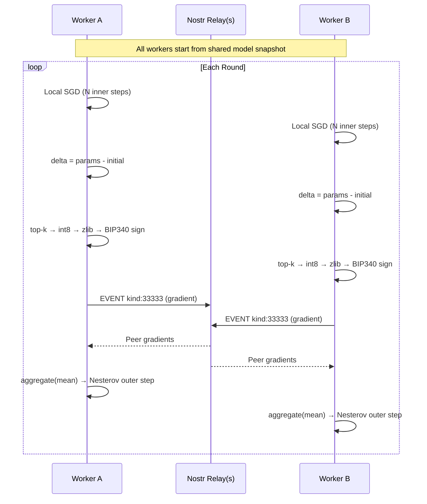

<div align="center">

# nostrain

**Coordinator-free distributed ML training over Nostr relays.**

Workers exchange compressed, Schnorr-signed pseudo-gradients through public WebSocket relays.<br>No central server. No custom infrastructure. Just [DiLoCo](https://arxiv.org/abs/2311.08105) over [Nostr](https://nostr.com).

[](https://python.org)
[](https://nostr.com)
[](https://arxiv.org/abs/2311.08105)
[](https://pypi.org/project/websockets/)

<br>


<p><sub>4 workers exchanging gradients through a local relay — live round-by-round progress</sub></p>


<p><sub>All workers converge to the same model — 97-99% loss reduction across data shards</sub></p>

</div>

---

## How it works



## Quick start

**1. Install**

```bash
pip install -e .
```

**2. Initialize a model**

```bash
nostrain init-state --runtime linear-regression --features 3 -o model.json
```

**3. Train across relays**

```bash
# Run this on each machine with different data shards
nostrain run-training model.json data.json \
  --relay wss://relay.damus.io \
  --relay wss://nos.lol \
  --run my-experiment \
  --sec-key $NOSTR_SECRET_KEY \
  --rounds 5 \
  --inner-steps 80 \
  --outer-learning-rate 0.7 \
  --momentum 0.9 \
  -o trained.json
```

Workers discover each other via heartbeat events and sync automatically.

## Demo: distributed GPT training over Nostr

The repo ships a complete demo that trains a character-level GPT on Shakespeare. Four workers each get a different slice of the text. No single worker sees the full corpus — they have to collaborate through the relay to learn the language.

```bash
pip install -e ".[torch]"
bash demo/gpt/run.sh
```

Or run headless (no tmux, everything in-process):

```bash
PYTHONPATH=. python demo/gpt/train.py --rounds 5 --inner-steps 100
```

### The model

The model in `demo/gpt/model.py` is a standard decoder-only transformer — the same architecture behind GPT-2, GPT-3, and every modern LLM, just smaller. Here's what's inside:

```
CharGPT (834K params)
├── tok_emb    Embedding(96, 128)     — maps each character to a 128-dim vector
├── pos_emb    Embedding(128, 128)    — learned position encodings (context = 128 chars)
├── blocks     4 × TransformerBlock
│   ├── ln_1   LayerNorm              — normalize before attention
│   ├── attn   CausalSelfAttention    — 4 heads, each 32-dim, masked so tokens
│   │          ├── c_attn  Linear(128, 384)  — project to Q, K, V in one shot
│   │          └── c_proj  Linear(128, 128)  — project attention output back
│   ├── ln_2   LayerNorm              — normalize before FFN
│   └── mlp    FFN                    — Linear(128, 512) → GELU → Linear(512, 128)
├── ln_f       LayerNorm              — final norm
└── head       Linear(128, 96)        — predict next character (96 = printable ASCII)
```

The input is a sequence of characters. Each character becomes a 128-dimensional embedding, gets a position encoding added, then flows through 4 transformer blocks. Each block runs **causal self-attention** (every token can only look at tokens before it — this is what makes it autoregressive) followed by a feed-forward network. The output is a probability distribution over the next character.

96 vocabulary tokens (printable ASCII), 128-dimensional embeddings, 4 layers, 4 attention heads, 128 context length. Total: **834,048 parameters**. Small enough to train on a CPU in minutes, large enough to learn non-trivial language structure.

### How the distributed training works

This is [DiLoCo](https://arxiv.org/abs/2311.08105) (Distributed Low-Communication Learning) — the same algorithm Google used to train language models across poorly-connected datacenters. The idea is beautifully simple:

**Inner loop (local).** Each worker trains independently on its own data shard using standard AdamW. This is regular gradient descent — nothing special. Each worker runs 100 steps, sees different text, learns different things.

**Pseudo-gradient.** After local training, each worker computes `delta = trained_params - initial_params`. This is the "pseudo-gradient" — a summary of what the worker learned in that round. Unlike real gradients (which are instantaneous slopes), pseudo-gradients capture the cumulative effect of many training steps.

**Compression.** The pseudo-gradient has 834K float values. We compress it:
1. **Top-k sparsification** (keep only the 30% largest values by magnitude)
2. **int8 quantization** (scale to [-127, 127])
3. **zlib compression**

Result: ~580KB per gradient event. This gets published as a Nostr event.

**Transport.** The compressed pseudo-gradient is packed into a NIP-01 event (kind `33333`), signed with a BIP340 Schnorr signature, and published to the relay. Workers also publish heartbeat events (kind `33334`) so they can discover each other. All standard Nostr — any relay works.

**Outer loop (aggregation).** Each worker subscribes to the relay, collects all peer gradients for the current round, decompresses them, and computes the **mean** across all workers. This averaged pseudo-gradient is applied using **Nesterov momentum** — a second-order update that looks ahead before stepping, converging faster than plain SGD.

Then the cycle repeats.

### What you'll see

The text evolves from random garbage to recognizable English over 5 rounds:

**Round 0 (random init):**
```
ROMEO:2NYPp@JTb<;2..qce[vP[qIto9TxFwIHb)D~?>o9[**c!$/?Z"yiFxy
```

**Round 1 (after first sync):**
```
ROMEO: Maf A1Exs w molinounan, sthat pine ted mes I chat, y hethanalher
```

**Round 3:**
```
ROMEO: Whe do he sthe senond pare at o pro ther fakis clotinthont se path
```

**Round 5:**
```
ROMEO: d I shes mear to the ce withat, tre so ther wisho sheath. do wiso
me ifon ithid An w'd onke r wour sple y thenoreancpe ay ak, hire d hie
```

Loss drops from ~4.5 to ~2.4. The model starts recognizing common English patterns — "the", "that", "ther", "and" — and begins forming word-like structures. It's not Shakespeare yet (you'd need more parameters and more training), but the trajectory is clear: the four workers, each seeing only 25% of the text, collaboratively learn the structure of the language by exchanging compressed updates through a Nostr relay.

### How nostrain maps to the training loop

Each round in the demo executes this exact sequence of nostrain operations:

```python
# 1. Publish heartbeat so peers can discover us
heartbeat = build_heartbeat_event(metadata, secret_key_hex=key)
await publish_nostrain_events(relay_urls, heartbeat)

# 2. Train locally with PyTorch (standard autograd)
optimizer = AdamW(model.parameters(), lr=3e-4)
for step in range(100):
    x, y = dataset.get_batch(32)
    loss = model(x, y)
    loss.backward()
    optimizer.step()

# 3. Compute pseudo-gradient: what did local training change?
trained_state = model_state_from_module(model)   # nn.Module → ModelState
delta = compute_delta(initial_state, trained_state)

# 4. Compress and publish as signed Nostr event
payload = compress_delta(delta, topk_ratio=0.3)   # 834K → 250K values, int8
event = build_gradient_event(payload, metadata, secret_key_hex=key)
await publish_nostrain_events(relay_urls, event)   # → relay

# 5. Collect peer gradients from relay
collection = await collect_gradient_events_across_relays(
    relay_urls, run_name=run, round_index=round_idx,
    idle_timeout=12.0, strategy="timeout", discover_workers=True,
)

# 6. Aggregate and apply outer step
outer = nesterov_outer_step(
    initial_state, collection.aggregate_delta(),
    learning_rate=0.7, momentum=0.9,
)

# 7. Load updated state back into PyTorch model
load_state_into_module(outer.next_state, model)
```

The PyTorch training (step 2) is completely standard — nostrain doesn't touch your model architecture, optimizer, or loss function. It only cares about the state before and after. Everything between `model_state_from_module` and `load_state_into_module` is framework-agnostic: the compression, signing, relay transport, aggregation, and outer step all operate on flat parameter tensors. You could swap PyTorch for MLX, JAX, or a pure-numpy implementation and the transport layer wouldn't change.

### A simpler demo (linear regression)

If you want something faster to verify the setup, there's also a linear regression demo:

```bash
bash demo/run.sh
```

4 workers learn `y = 3x₁ - 1.5x₂ + 0.5x₃ + 1` from non-overlapping data shards. Takes about 60 seconds, all workers converge to the true weights. Same DiLoCo loop, much smaller model (4 parameters).

## Compression pipeline

```
pseudo_gradient = params - initial
        │
        ▼
  top-k sparsification ─── keep k% largest values
        │
        ▼
  int8 quantization ────── scale to [-127, 127]
        │
        ▼
  NSTR wire format ─────── magic + sparse index layout
        │
        ▼
  zlib/zstd ────────────── compressed bytes
        │
        ▼
  base64 → Nostr event content
```

A 10k-parameter gradient at `topk=0.1` compresses to ~1KB.

## Nostr protocol

Three NIP-01 event kinds, all BIP340 Schnorr signed:

| Kind | Type | Content |
|:---:|---|---|
| `33333` | Gradient | Compressed pseudo-gradient payload (base64) |
| `33334` | Heartbeat | Empty — capabilities and relay hints in tags |
| `33335` | Checkpoint | Serialized training state for recovery |

Works with any relay that indexes on `kind` and `#t` tags.

## Configuration

### `run-training` flags

| Flag | Default | Description |
|---|:---:|---|
| `--relay` | *required* | WebSocket relay URL (repeatable) |
| `--run` | *required* | Shared run name across workers |
| `--sec-key` | *required* | Hex Nostr secret key |
| `--rounds` | `1` | Number of outer rounds |
| `--inner-steps` | `500` | Local SGD steps per round |
| `--local-learning-rate` | `0.01` | Inner loop learning rate |
| `--outer-learning-rate` | `0.7` | DiLoCo outer step learning rate |
| `--momentum` | `0.9` | Nesterov outer momentum |
| `--batch-size` | `1` | Mini-batch size |
| `--topk` | `1.0` | Gradient sparsity (0.1 = keep 10%) |
| `--round-timeout` | `2.0` | Seconds to wait for peer gradients |
| `--backend` | `python` | `python`, `numpy`, or `torch` |
| `--resume-latest-checkpoint` | — | Rejoin from relay-distributed checkpoint |

### Sync strategies (for `collect-events` / `aggregate-round`)

| Strategy | Behavior |
|---|---|
| `timeout` | Aggregate whatever arrives within N seconds |
| `strict` | Wait for exactly N workers |
| `quorum` | Wait for majority of discovered workers |
| `async` | Return immediately with local gradient only |

## Fault tolerance

- **Multi-relay** — publish to N relays, collect from all, deduplicate by event fingerprint
- **Retry + backoff** — configurable exponential backoff on transient failures
- **Late gradients** — fold into next round (`deferred`) or record-only (`discard`)
- **Checkpoint recovery** — resume from local file or discover latest from relay
- **Rolling retention** — bound relay-visible checkpoint history per worker

## State formats

```bash
nostrain convert-state model.json -o model.npz       # NumPy archive
nostrain convert-state model.json -o model.pt.npz     # PyTorch state-dict archive
nostrain convert-state model.json -o model.pt         # Native torch.save
```

PyTorch import auto-handles `module.*` prefixes, `state_dict`/`model_state_dict` wrappers, and nested checkpoint bundles.

## CLI

```
nostrain init-state             Initialize model state for a built-in runtime
nostrain hash-state             Deterministic model hash
nostrain convert-state          Convert between JSON / npz / pt formats

nostrain encode-delta           Compress a pseudo-gradient
nostrain decode-payload         Decompress a payload
nostrain apply-payload          Reconstruct state from base + payload
nostrain aggregate-payloads     Average multiple worker payloads

nostrain outer-step             Apply DiLoCo outer step with momentum
nostrain train-local            Run inner SGD loop locally

nostrain build-event            Build signed gradient event
nostrain build-heartbeat        Build signed heartbeat event
nostrain build-checkpoint       Build signed checkpoint event
nostrain inspect-event          Validate and inspect an event

nostrain publish-event          Publish to relay(s)
nostrain collect-events         Collect round events from relay(s)
nostrain aggregate-round        Collect + aggregate in one step
nostrain discover-workers       List active workers
nostrain discover-checkpoints   Find latest checkpoint
nostrain derive-pubkey          Derive pubkey from secret key

nostrain run-training           Full distributed training session
```

## Python API

```python
from nostrain import (
    compute_delta, compress_delta, state_digest,
    aggregate_deltas, nesterov_outer_step,
    build_gradient_event, schnorr_sign,
    run_training_session, TrainingWorkerConfig,
)

# Compress a pseudo-gradient
delta = compute_delta(initial_state, trained_state)
payload = compress_delta(delta, topk_ratio=0.1)

# Publish as a signed Nostr event
event = build_gradient_event(
    payload=payload,
    run_name="experiment-1",
    round_number=0,
    worker_id=pubkey,
    model_hash=state_digest(initial_state),
    secret_key=secret_key,
)
```

## Optional dependencies

| Extra | Package | Enables |
|---|---|---|
| `numpy` | `numpy>=1.26` | `.npz` state I/O, NumPy training backend |
| `torch` | `torch>=2.1` | `.pt`/`.pth` checkpoints, torch training backend |
| `zstd` | `zstandard>=0.22` | zstd compression (default: zlib) |

```bash
pip install -e ".[numpy,torch,zstd]"
```

## Design decisions

**Why Nostr?** Public relay infrastructure already exists — WebSocket pub/sub at scale with cryptographic identity built in. Zero servers to deploy.

**Why pure-Python crypto?** BIP340 Schnorr signatures using only `hashlib`. No compiled extensions, installs everywhere.

**Why framework-agnostic transport?** The wire protocol never imports `torch` or `numpy`. Framework code lives at the edges and is entirely optional.

## License

MIT
