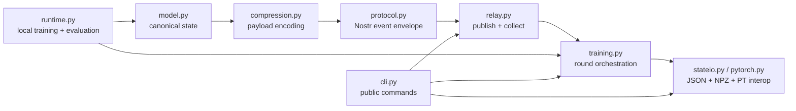

# Architecture

## System overview

`nostrain` is a library-first system with a CLI wrapper. The core loop is:

1. Load a deterministic model state.
2. Train locally for `N` inner steps.
3. Compute `delta = trained_state - base_state`.
4. Compress and sign the delta into a Nostr event.
5. Publish to one or more relays.
6. Collect peer events for the same run and round.
7. Aggregate deltas and apply the outer update.
8. Emit checkpoints and round artifacts for recovery and debugging.

## Component boundaries



## Core invariants

- `ModelState` parameter names are unique and deterministically ordered.
- State hashes are computed from canonical parameter names, shapes, and
  double-precision values.
- Every accepted gradient, heartbeat, and checkpoint event must parse and
  validate before it is admitted into collection results.
- Gradient aggregation uses an example-weighted mean when events advertise
  example counts, otherwise it falls back to one vote per worker for backward
  compatibility with older publishers.
- A collection keeps only one event per worker identity for a run/round
  identity, preferring newer events and then smaller event IDs as a tiebreaker.
- Checkpoint content must agree with checkpoint tags and model hashes.
- Retry and partial-relay failures must remain visible in result objects and
  JSON summaries.

## Deployment context

The project has three operational modes:

- library usage inside another Python training flow
- CLI-driven local or multi-host training runs
- demo mode with a local relay and generated artifacts

This is not a long-running web service. There is no `/health` endpoint because
the operational surface is command execution plus relay connectivity.

## Failure model

Expected failures the code already handles:

- one or more relays rejecting or dropping a publish
- subscription disconnects and retried reconnects
- duplicate relay replays
- stale heartbeats
- late gradients arriving after a worker resumes from checkpoint

Failures that remain largely operator-driven today:

- hostile or malformed public relays beyond current protocol validation
- missing external metrics/tracing pipelines
- large-scale performance regression detection beyond the current integration
  suite

## Runbook

### Local smoke test

```bash
python -m pip install -e ".[dev,numpy]"
python -m pytest tests/test_relay.py -q
python -m nostrain --help
```

### Debugging a bad round

When `run-training` is executed with `--artifact-dir`, inspect:

- `round-XXXX/base-state.json`
- `round-XXXX/local-delta.json`
- `round-XXXX/collection.json`
- `round-XXXX/checkpoint.json`
- `retention.json`

These files are the primary debugging surface today.

### Recovery

- Resume from an explicit file with `--resume-from`.
- Resume from relay-discovered state with `--resume-latest-checkpoint`.
- If late gradients were deferred, inspect `late_gradients` and
  `late_reconciliations` in the summary and checkpoint JSON before continuing.

## Known architectural limits

- Built-in runtimes are intentionally narrow: `linear-regression` and
  `mlp-regression`.
- Relay observability is JSON-summary based, not metrics/traces based.
- Coverage is strongest for integration behavior and weaker for direct
  line-by-line accounting because much of the CLI is exercised through
  subprocess tests.
